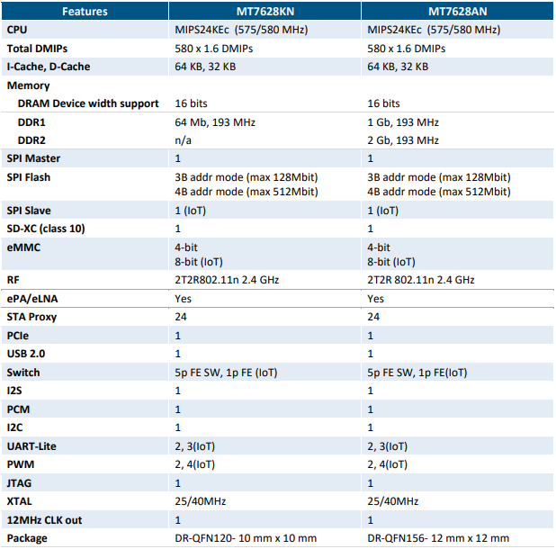

# [MT7628](https://github.com/SoCXin/MT7628)

* [MediaTek](https://www.mediatek.com/): [24KEc](https://github.com/SoCXin/MIPS)
* [L6R6](https://github.com/SoCXin/Level): 580 MHz x 1.55 DMIPS/MHz (3.05 CoreMark/MHz)

## [简介](https://github.com/SoCXin/MT7628/wiki)

[MT7628](https://github.com/SoCXin/MT7628) 整合了 2T2R 802.11n Wi-Fi 收发器、580MHz MIPS® 24KEc™ 中央处理器 (CPU)、5 端口高速以太网络端口物理层 (Ethernet PHY)、AES128/256 安全引擎、USB2.0 主机、PCIe 主机，以及连接不同传感器的多个慢速输入输出 (I/O)。MT7628A 可连接 11ac 同步双频路由器的外部动态随机内存 (DRAM)。路由器模式提供 5p FE 开关，主要是为路由应用而设。另一方面，物联网模式则支持 1p FE 及众多慢速输入输出 (I/O)。用户可加入 802.11ac 芯片组，以建立 802.11ac 同步双频物联网网关。MT7628K 内建 8MB 内存，提供小型路由器、中继器、物联网网桥、储存器及音讯应用的 eCos 统包方案。MT7628N 所提供的功能与 MT7628A 大致相同，不同的是 MT7628N 的 PCIe 及物联网模式主要是为了 N300 路由器而设。

### 关键特性

* 2T2R 802.11n Wi-Fi AP
* 5 port Fast Ethernet Switch

#### 封装规格

* QFN156 (12×12mm)
* QFN120 (10×10mm)

### [资源收录](https://github.com/SoCXin)

* [参考资源](src/)
* [参考文档](docs/)
* [参考工程](project/)

### [选型建议](https://github.com/SoCXin)

[MT7628](https://github.com/SoCXin/MT7628)

### [探索芯世界 www.SoC.xin](http://www.SoC.Xin)
